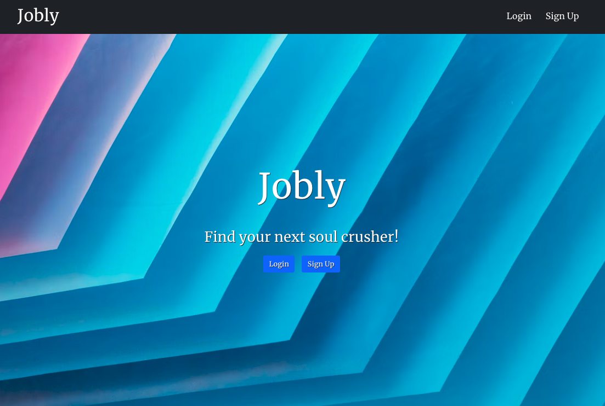
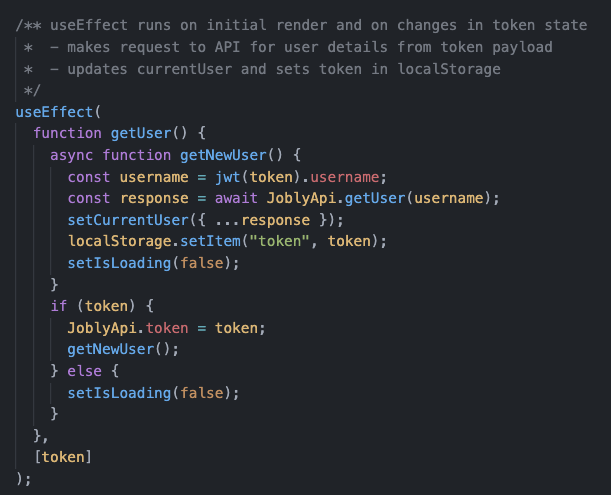

# Jobly

Jobly is a job search application built with a React front-end, Express RESTful API and PostgreSQL database. The API includes full CRUD capabilties on companies, jobs and users and the option to filter by queries. Authorization is required for both front and back-end for select endpoints.

View working demo [here](https://jobly-yuri.surge.sh/).

### Technologies
- React & React Router
- Axios
- Express
- JWT
- Bcrypt
- PostgreSQL
- Jest

_The backend code used in this application was provided by [Rithm School](https://www.rithmschool.com/), we built the backend as a separate exercise (code can be found [here](https://github.com/robynlgy/express-jobly)). Pair programmed with [Yuri Belorusets](https://github.com/yuribelorusets) on this application._

## Available Routes

- /
- /login
- /signup
- /companies
- /companies/:handle
- /jobs
- /profile

## Main function controlling current user in app

1. Rehydrates current user state through searching in localStorage for any token on mount.
2. If a token is found, the token is saved for subsequent API calls and current user state and context is updated with info from API. Application interface will also be updated.
3. If no token is found, login/signup buttons are shown.

